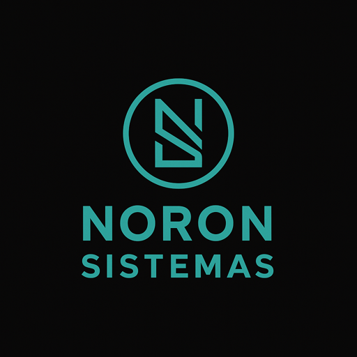

  

<h1 align="center">Noron Sistemas</h1>

  Explorando los límites entre la tecnología, el arte, la mística y la conciencia.

---

# Noron Sistemas

**Soluciones tecnológicas e investigación en ciberseguridad.**

---

## 👥 Quiénes Somos

**Noron Sistemas** es una iniciativa independiente fundada por dos hermanos, **Guille** e **Isaias**, ambos profesionales con sólida experiencia en **administración de sistemas**, **ciberseguridad**, y **automatización de procesos IT**.

Nuestra misión es desarrollar herramientas eficientes, seguras y de código abierto que potencien el análisis técnico, el monitoreo de sistemas y la exploración de nuevas fronteras digitales.

---

## 🛠️ Proyectos Principales

### 🔍 `guilleXploit`
> Buscador automatizado de vulnerabilidades en middleware - basado en el CVE-2025-29927.  
[Repositorio](https://github.com/noronsistemas/guilleXploit)

---

### 🧠 `FS-Wizard`
> Toolkit avanzado para análisis forense de sistemas de archivos e inodes. Incluye funciones de recuperación, exploración profunda y técnicas de carving.  
Landing page: [https://noronsistemas.github.io/fs-wizard](https://noronsistemas.github.io/fs-wizard)

---

## 📄 Recursos de Marca

- `BRAND.md`: Guía visual y lineamientos gráficos.
- Logos y elementos oficiales disponibles en el repositorio.

---

## 📬 Contacto

- GitHub: [@noronsistemas](https://github.com/noronsistemas)  
- Sitio web oficial (en desarrollo)  
- Red Matrix y RSS técnico próximamente.

---

> *Noron Sistemas: Transformamos la ingeniería en herramientas prácticas para un mundo más seguro.*
